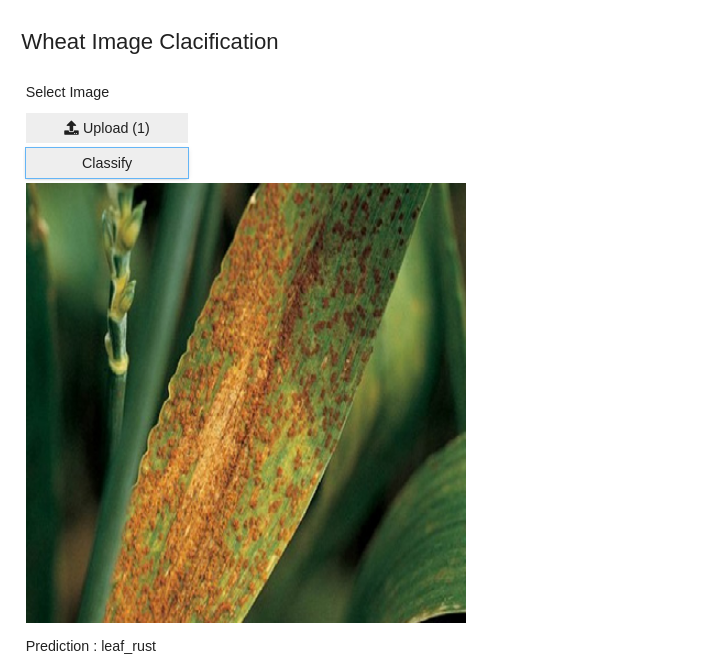

# Wheat Rust Classification

This repository contains code and data for classifying wheat rust using machine learning techniques.

## Data

The data used in this project is a collection of images of wheat leaves infected with rust. The images are split into training and testing sets, with 80% of the images used for training and 20% used for testing.

## Code

The code in this repository is written in Python using the PyTorch framework. It consists of several Jupyter notebooks that walk through the steps of loading and preprocessing the data, creating a neural network model, training the model, and evaluating its performance.

## Results

After training the model on the training set, we achieved an accuracy of 91.5% on the testing set. Here is a confusion matrix showing the model's performance on each class:

We also generated some sample predictions on a few test images. Here are a few examples:

## Conclusion

In this project, we developed a machine learning model for classifying wheat rust with high accuracy. This model has the potential to be used in real-world scenarios to help farmers identify and treat wheat rust infections before they become widespread.